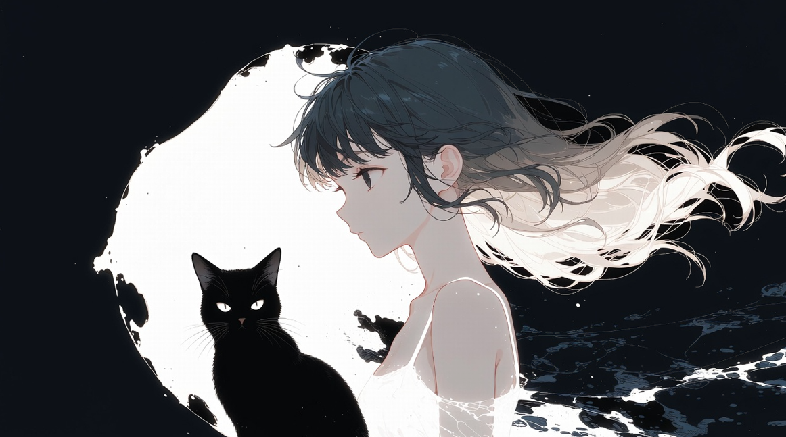

[English](README.md) · [日本語](README-ja.md) · [繁體中文](README-zh-TW.md) · [简体中文](README-zh.md) · [Deutsch](README-de.md) · Español · [Latina](README-la.md)

Aunque la IA es útil para programar, aprender, etc., veo problemas en la forma en que influye en los dibujos, el 3D, el contenido de texto, las obras de arte, la cultura y la historia, la web y la identidad individual. Así fue como empecé a explorar las ZKP (pruebas de conocimiento cero) y la criptografía.

Exploro herramientas como el seguimiento de procedencia con OpenTimestamps, la divulgación selectiva en sistemas agénticos, las credenciales verificables y los estándares C2PA, para proteger mejor el arte digital y mantener el control sobre el origen de los contenidos.

Proyectos

<pre></pre>

[my-synthv-list](https://github.com/voca-synth/my-synthv-list)  
Crea tu propia lista de reproducción de Vocaloid, Synthesizer V o cualquier música a partir de YouTube  
japanese-learning · music · synthesizer-v · synthv · youtube

[manga-vastai](https://github.com/anime-research/manga-vastai)  
Reproducción: orquestación de la producción de yonkoma educativos (manga de 4 viñetas) con Stable Diffusion en Vast.ai  
agentic-orchestration · education · manga · stable-diffusion-cpp · vast-ai · vastai · yonkoma

[lpchart](https://github.com/didvc/lpchart)  
Grafica el line protocol de InfluxDB en tu terminal. stats++  
data-explorer · golang · influxdb · line-protocol · metrics · observability · timeseries · timeseries-analysis · timeseries-data · tui-go

[dead-mans-ping](https://github.com/didvc/dead-mans-ping)  
Interruptor de hombre muerto, baliza de presencia, notificador de inactividad. Basado en la (in)actividad del ratón.  
automation · dead-mans-switch · deadmanswitch · healthcheck · heartbeat · inactivity-monitor · mouse-activity · privacy · privacy-tools · tui-go

[simple-desktop-replay](https://github.com/didvc/simple-desktop-replay)  
Software de búfer de repetición (replay buffer) para el escritorio de Windows. Ligero, de bajo consumo y hecho en Rust desde su diseño.  
desktop-duplication · dvr · instant-replay · replay-buffer · screen-capture · screen-recorder · video-encoding · windows

[better-super-simple-highlighter](https://github.com/didvc/better-super-simple-highlighter)  
Super Simple Highlighter, la extensión de Chrome para resaltar texto, súper mejorada.  
annotation · chrome-extension · highlighter · highlighting · note-taking · notetaking · productivity · productivity-tool · web-annotation

<pre></pre>

`https://identity-vulpes.pages.dev/` / Deja un mensaje

{ gen_z, cryptology, arts, linguistics, provenance } ©2026 Vulpes

Las opiniones aquí expresadas son mías y no representan a ninguna organización a la que pueda pertenecer.

¿Necesitas mi ayuda?

<pre></pre>

Normalmente trabajo de forma totalmente online, ya sea con horario flexible o a tiempo parcial, pero a ciertos países (p. ej., Austria, Alemania, Dinamarca, Suiza) puedo desplazarme con gusto por ti o por tu empresa. Para cualquier consulta, contáctame directamente a través de la dirección de correo @duck que aparece a la izquierda de esta página.

<pre></pre>

¿Buscas una relación?

<pre></pre>

Si encontraste a Aesthetic Vulpes mediante la búsqueda avanzada, un repositorio o cualquier tipo de investigación o método agéntico en el mar de GitHub / Internet, y te interesa Aesthetic Vulpes a nivel personal, acepto con gusto tu propuesta de conversar. Para relaciones de amistad no hay criterios en particular. Para una posible relación comprometida, ten presentes brevemente estos criterios generales.

- Eres (soy) una persona geek (no en cuanto a moda/apariencia, sino en cuanto a tu forma de pensar/estilo de vida).
- Prefieres (prefiero) pasar el tiempo en casa antes que fuera.
- Eres genética Y biológicamente mujer Y hetero o bi (yo soy hetero; tu orientación no me importa).
- No eres (no soy) el tipo de persona que miente u oculta cosas cuando se le pregunta por asuntos serios (por ejemplo, estado de salud, problemas de dinero, etc.).

Nota: a septiembre de 2026 vivo en soltería, pero esto puede cambiar con el tiempo. Cuando quieras, pregúntame si sigo disponible.

<pre></pre>

Licencias

<pre></pre>

Código = MIT, contenido de texto e imágenes = CC BY 4.0

Cita: [https://github.com/didvc](https://github.com/didvc)

<pre></pre>

(Varios)

Para mis perfiles de MyAnimeList, Chess.com, IMDb, Discord, etc., pregúntame.

(además: Pixiv, Goodreads, VocaDB, TradinView, YouTube, Liked, Wikipedia, etc.)

  

Música del mes

<pre></pre>

  
El vals de la pulga (The Flea Waltz). feat. KAFU

  

  
Lilium, versión de Grissini Project

  

<pre></pre>

