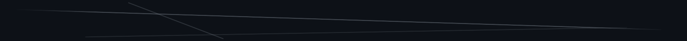
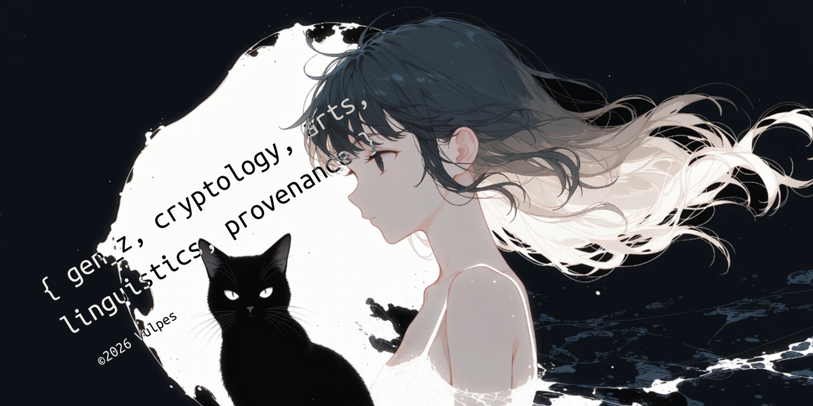

[English](README.md) · 日本語 · [繁體中文](README-zh-TW.md) · [简体中文](README-zh.md) · [Deutsch](README-de.md) · [Español](README-es.md) · [Latina](README-la.md)

# Aesthetic Vulpes [ didvc ]

AIはコーディングや学習などには便利ですが、イラスト、3D、テキストコンテンツ、アート作品、文化や歴史、Web、そして個人のアイデンティティへの影響の仕方には問題があると考えています。それがきっかけで、ゼロ知識証明（ZKP）や暗号技術を探求し始めました。

デジタルアートをよりよく守り、コンテンツの出自を自分の手で管理し続けるために、OpenTimestampsによる来歴追跡、エージェント型システムにおける選択的開示、検証可能なクレデンシャル（VC）、C2PA規格といったツールを探求しています。

## プロジェクト

[my-synthv-list](https://github.com/voca-synth/my-synthv-list)  
YouTubeから、ボカロやSynthesizer V、そのほかどんな音楽でも自分だけのプレイリストを作成  
japanese-learning · music · synthesizer-v · synthv · youtube

<h3>もっと見る</h3>

[manga-vastai](https://github.com/anime-research/manga-vastai)  
Vast.ai上のStable Diffusionで教育4コマ漫画の制作をオーケストレーションする再現  
agentic-orchestration · education · manga · stable-diffusion-cpp · vast-ai · vastai · yonkoma

[lpchart](https://github.com/didvc/lpchart)  
InfluxDBラインプロトコルをターミナル上でグラフ表示。統計機能もさらに充実（stats++）  
data-explorer · golang · influxdb · line-protocol · metrics · observability · timeseries · timeseries-analysis · timeseries-data · tui-go

[dead-mans-ping](https://github.com/didvc/dead-mans-ping)  
デッドマンスイッチ、在席ビーコン、アイドル通知。マウスの操作・無操作をもとに動作。  
automation · dead-mans-switch · deadmanswitch · healthcheck · heartbeat · inactivity-monitor · mouse-activity · privacy · privacy-tools · tui-go

[simple-desktop-replay](https://github.com/didvc/simple-desktop-replay)  
Windowsデスクトップ向けのリプレイバッファソフトウェア。軽量・低負荷で、設計段階からRust製。  
desktop-duplication · dvr · instant-replay · replay-buffer · screen-capture · screen-recorder · video-encoding · windows

[better-super-simple-highlighter](https://github.com/didvc/better-super-simple-highlighter)  
テキストハイライト用Chrome拡張機能「Super Simple Highlighter」を大幅に強化したもの。  
annotation · chrome-extension · highlighter · highlighting · note-taking · notetaking · productivity · productivity-tool · web-annotation

私のすべてのプロジェクトは、興味があればカテゴリー別にまとめて [ごめんなさい、まだ準備中です。1〜2か月後くらいになりそうです。] で見られます。

`https://identity-vulpes.pages.dev/` / メッセージを残す

{ gen_z, cryptology, arts, linguistics, provenance } ©2026 Vulpes

ここでの見解は個人的なものであり、私が所属する可能性のあるいかなる組織の見解を代表するものでもありません。

<h2>お困りですか？</h2>

フレックスでもパートタイムでも、基本的には完全オンラインで仕事をしていますが、一部の国（オーストリア、ドイツ、デンマーク、スイスなど）であれば、あなたやあなたの会社のために現地へ出向くこともできます。お問い合わせは、このページの左側に表示されている @duck のメールアドレスまで直接ご連絡ください。

<h2>Vulpesに興味がありますか？</h2>

GitHubやインターネットの海の中から、高度な検索、リポジトリ、何らかの調査やエージェント的な手段を通じてAesthetic Vulpesを見つけ、個人的に興味を持ってくださったなら、お話のお誘いは喜んでお受けします。友人としての関係であれば、特に条件はありません。真剣なお付き合いの可能性を考えている場合は、[social/relationship.md](social/relationship.md) にある大まかな条件をご覧ください（英語）。

## その他

MyAnimeList、Chess.com、IMDb、Discordなどのアカウントは、聞いてもらえればお教えします。

（ほかにも：Pixiv、Goodreads、VocaDB、TradinView、YouTube、Liked、Wikipediaなど）

  

<h3>ライセンス</h3>

コード = MIT、テキストコンテンツと画像 = CC BY 4.0

引用: [https://github.com/didvc](https://github.com/didvc)

<h3>今月の音楽</h3>

  
ねこふんじゃった（The Flea Waltz） feat. 可不

  

  
Lilium（Grissini Projectによるカバー）

  

